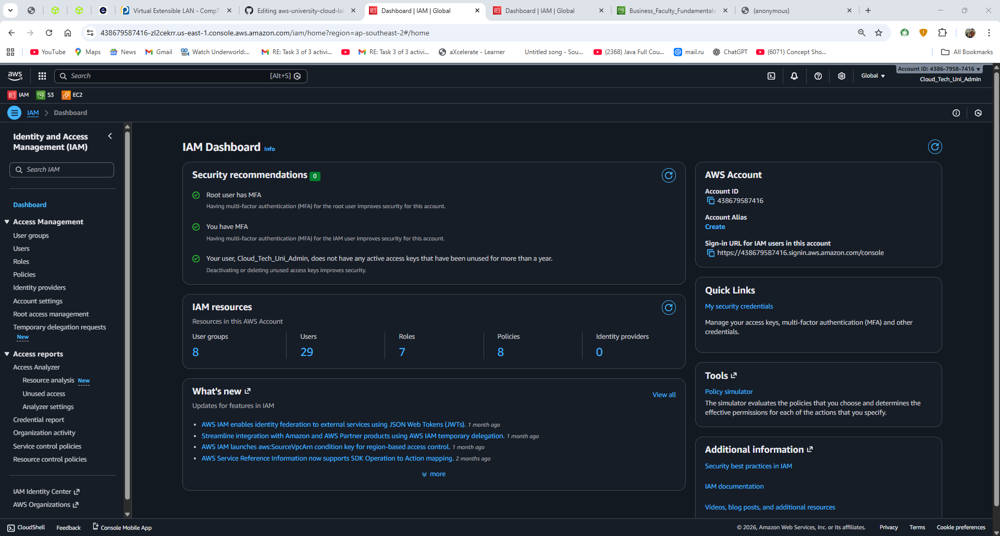
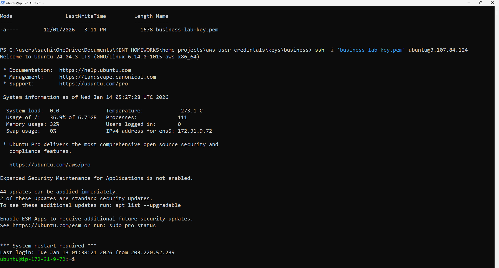
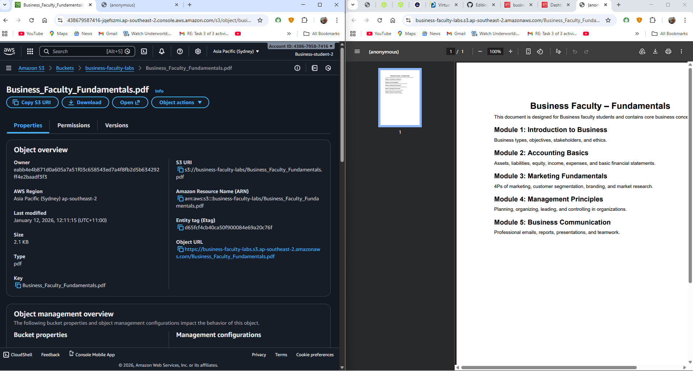
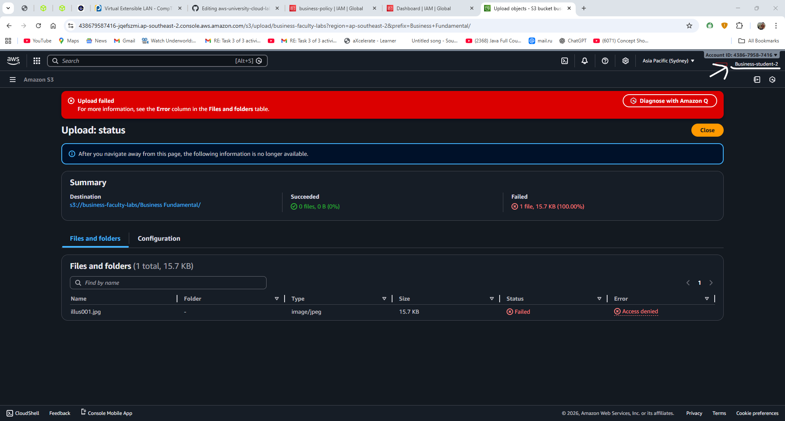
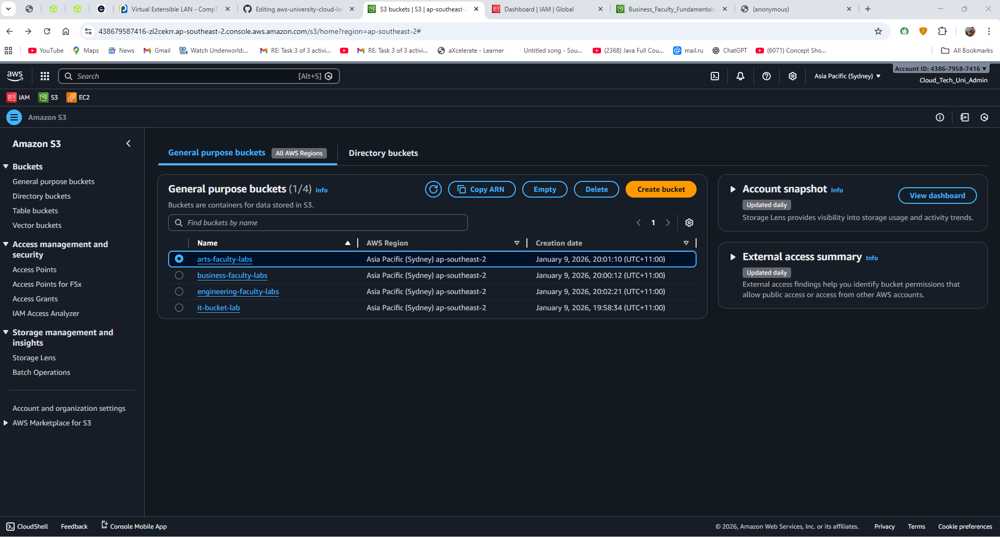
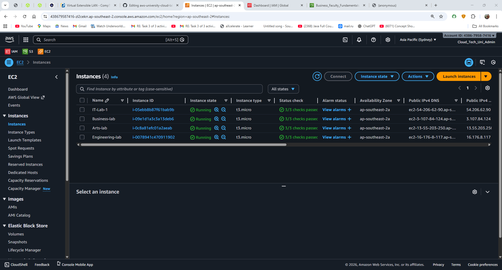
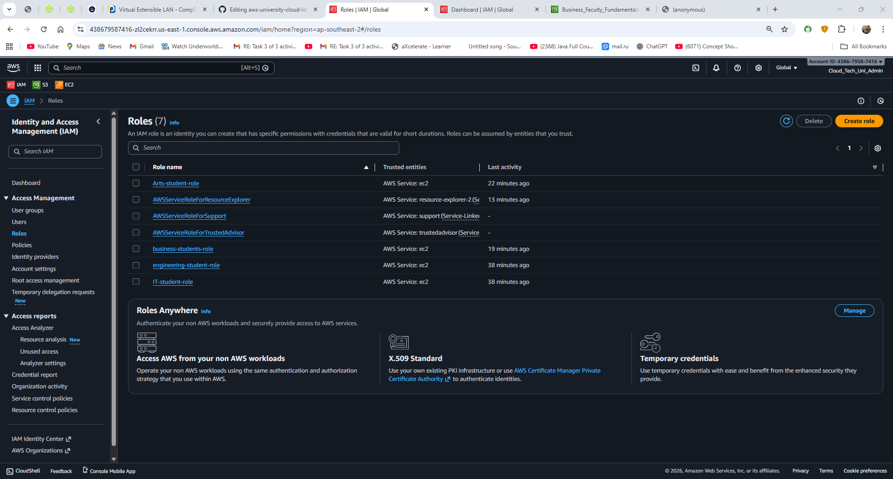
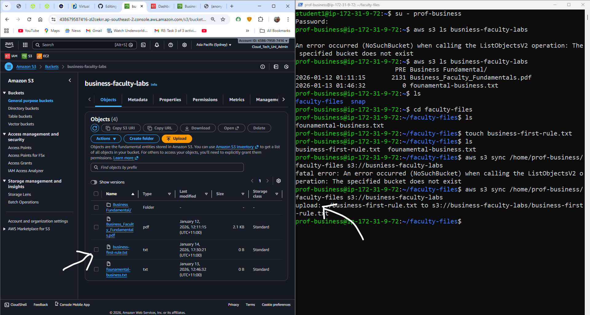

# AWS University Cloud Lab System

## Project Overview
This project simulates a University cloud environment using Amazon Web Services (AWS).  
The goal of this project is to show how different users in a university (Admin, Professors, and Students) can securely access cloud resources based on their roles.
	Each faculty (IT, Business, Engineering, Arts) has:
- Its own EC2 instance (virtual server)
- Its own S3 bucket (file storage)
- Controlled access using IAM policies
This project focuses on security,role-based access, and real-world cloud practices.

## Objectives of the Project
- Understand AWS IAM users, groups, and policies  
- Implement least privilege access
- Separate access for students and professors
- Use EC2 + S3 together
- Practice SSH login and file synchronization
- Simulate a real university lab setup in the cloud

##  AWS Services Used
-	AWS IAM – User, group, and policy management  
-	Amazon EC2 – Virtual machines for faculty labs  
-	Amazon S3 – File storage for each faculty  
-	AWS CLI – Access AWS services from EC2 using terminal  
-	SSH – Secure login into EC2 instances  
## User Roles and Access Design
###  Root User
-	Full control over AWS account
-	Used only for initial setup
-	Not used for daily work (security best practice)

### Admin
-	Manages IAM users and policies
-	Creates EC2 instances
-	Creates S3 buckets
-	Has full administrative access

**Screenshot**
Homepage of Admin:

 
Policy create by admin for all the users: 

### Professors
-	Can upload, edit, and delete files in their faculty bucket
-	 Can access their faculty EC2 instance using SSH
-	Cannot access other faculty resources
-	Cannot manage IAM users
  
**Screenshot**
Policy created for the professors for the Business faculty:

Login into Business faculty EC2 via SSH in power-shell: 

### Students
-	Can only view and download files from their faculty bucket
-	Cannot upload or delete files
-	Cannot create buckets or EC2 instances
  
**Screenshot**
Policy  for  the students of business faculty: 

Permission granted to open the file for the respective faculty students:
 

Permission denied to upload the file for the respective faculty students: 

## S3 Bucket Structure
Each faculty has its own bucket:
-	`it-bucket-lab`
-	`business-faculty-labs`
-	`engineering-faculty-labs`
-	`arts-faculty-labs`
These buckets store:
-	Study materials
-	Lab files
-	Faculty documents
  
**Screenshot**

Buckets for each faculty: 

Files inside the respective bucket: 

## EC2 Instance Setup
Each faculty has one EC2 instance:
-	IT Faculty → Amazon Linux
-	Business Faculty → Ubuntu
-	Engineering Faculty → ubuntu
-	Arts Faculty → Ubuntu

All instances are:
-	Accessed using SSH key pairs
-	Connected securely from local PowerShell
-	Used to upload files to S3 using AWS CLI
  
**Screenshot**

EC2 instances for each faculty with different OS:

SSH connection terminal to EC2: 

### Authentication & Access Management Design
-	Professor Access (Using Access Keys):
Professors use IAM access keys with the AWS CLI to upload, change, or delete files in their own S3 buckets. This is done to show how trusted staff or developers work in real life. Their access is limited by IAM policies, so they can only do what is needed and nothing more.
**Screenshot**:
 	
 
-	Student Access (Using IAM Roles):
Students do not get any access keys. Instead, their EC2 machines use IAM roles that allow only read-only access to specific S3 buckets. This means students can view and download files safely, without storing any secret keys, which is more secure and follows AWS best practices.

Roles for the students: 

Student Listing the file of S3 buckets form terminal: 

## EC2 and S3 Integration
-	Files are created inside EC2
-	Files are synced and uploaded to S3 using: 
aws s3 sync ‘the path to your folder in EC2 terminal’ s3://’name of the bucket you have created’
-	And to list the files and folder of S3 in EC2 using:
aws s3 ls ‘name of the bucket’ ----------> to list the files
aws s3 cp ’name of the bucket’ ---------> to copy the files
**Screenshot**
 	
Before files inside the bucket:

 
After creating a files inside the bucket via EC2 : 

**THANKYOU FOR LOOKING INTO MY PROJECTS. I HOPE YOU HAVE A GOOD DAY AND GOD BLESS YOU.
MADE BY: SACHIN SHRESTHA**
